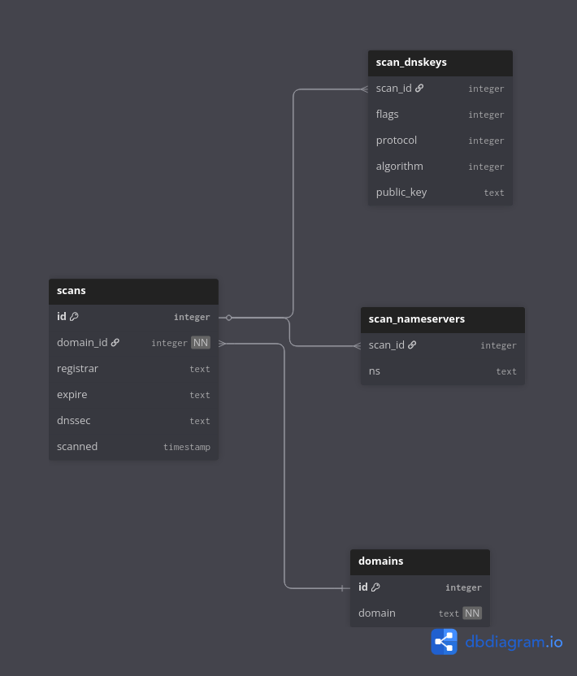

# 🦎 Gecko Scan

**Gecko Scan** is a Python CLI tool for analyzing URLs and performing security checks on websites.  
It supports multiple online services, generates PDF reports, and can save results into a local SQLite database.

---

## 🚀 Features

- Test website availability and connectivity:
  - VirusTotal
  - Whois
  - DNSDumpster
  - WhereGoes
- Select which tools to use via an interactive CLI
- Store scan results in a local SQLite database (optional)
- Generate detailed PDF and HTML reports for each scan
- Color-coded output for easy readability (green = OK, red = ERROR)

---

## ⚙️ Installation

```bash
# Clone the repository
git clone https://github.com/SmerovacDusan/informatika-semestralni-projekt.git
cd informatika-semestralni-projekt

# (Optional) Create a virtual environment
python -m venv venv
source venv/bin/activate  # Linux/macOS
venv\Scripts\activate     # Windows

# Install dependencies
pip install -r requirements.txt
```

---

## 💻 Usage

Start the program:
```bash
python3 gscan.py
```

**CLI Commands**

| Command       | Description                                                                                     |
| -----------   | ----------------------------------------------------------------------------------------------- |
| `help`        | Show available commands                                                                         |
| `tools`       | Select one or more tools to use. To unselect a tool, type its number and confirm when prompted  |
| `url`         | Set the target URL                                                                              |
| `db on`       | Enable storing results in the database                                                          |
| `db off`      | Disable storing results in the database                                                         |
| `report pdf`  | Select PDF report. To unselect, type this command again                                         |
| `report html` | Select HTML report. To unselect, type this command again                                        |
| `run`         | Run the analysis using selected tools                                                           |
| `exit`        | Exit the program                                                                                |

---

## 🔧 Supported Tools / Analyses
1. **VirusTotal**
    - Checks URL for malware and other threats
    - Provides detection score and engine-specific results

2. **Whois**
    - Retrieves domain ownership info
    - Shows creation, expiration, last update, registrar, and name servers

3. **DNSDumpster**
    - Fetches DNS records: A, MX, NS, TXT
    - Provides host info, IPs, open services, ASN

4. **WhereGoes**
    - Tracks URL redirects (shortened or tiny links)
    - Lists the complete redirection path

---

## 📄 Reports

- Generated automatically after each analysis
- Contains results for all selected tools
- Two report types - PDF and HTML
- Select/unselect report type `report pdf` / `report html`
- Filenames include the URL and timestamp in format `dd-mm-yyyy_hh-mm-ss`
- Stored in `reports/pdf` and `reports/html`

**Reports directory structure:**

<pre>
reports/
├── html/
│    └── 25-12-2025_15-45-12_https-example-com.html
└── pdf
        └── 25-12-2025_15-45-12_https-example-com.pdf
</pre>

---

## 🗄️ Database

- Optional SQLite database stored in `database/domain_audit.db`
- Tables:
    - `domains` – list of scanned domains
    - `scans` – scan metadata (registrar, expiration, DNSSEC, timestamp)
    - `scan_nameservers` – nameservers per scan
    - `scan_dnskeys` – DNSKEY records from WHOIS
- Enable/disable database recording using `db on` / `db off` commands
- Each scan creates a new record



---

## 📝 Example Workflow

```
> url
url> https://example.com
​[+] Using: https://example.com

> tools
tools> 1
tools> 2
tools> exit

> report html

> run
[+] Analysis started
[+] Report saved as 25-12-2025_15-45-12_https-example-com.pdf
[+] Report saved as 25-12-2025_15-45-12_https-example-com.html
[+] Analysis done
[+] Record added to the database
```

---

## ⚖️ License

This project is licensed under the **MIT License**.  
See the [LICENSE](LICENSE) file for details.